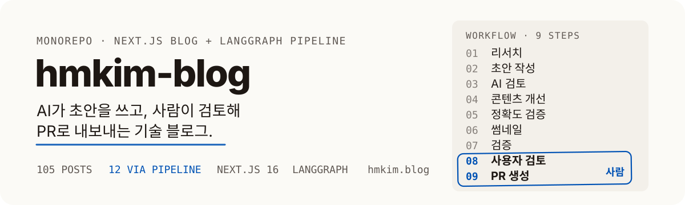
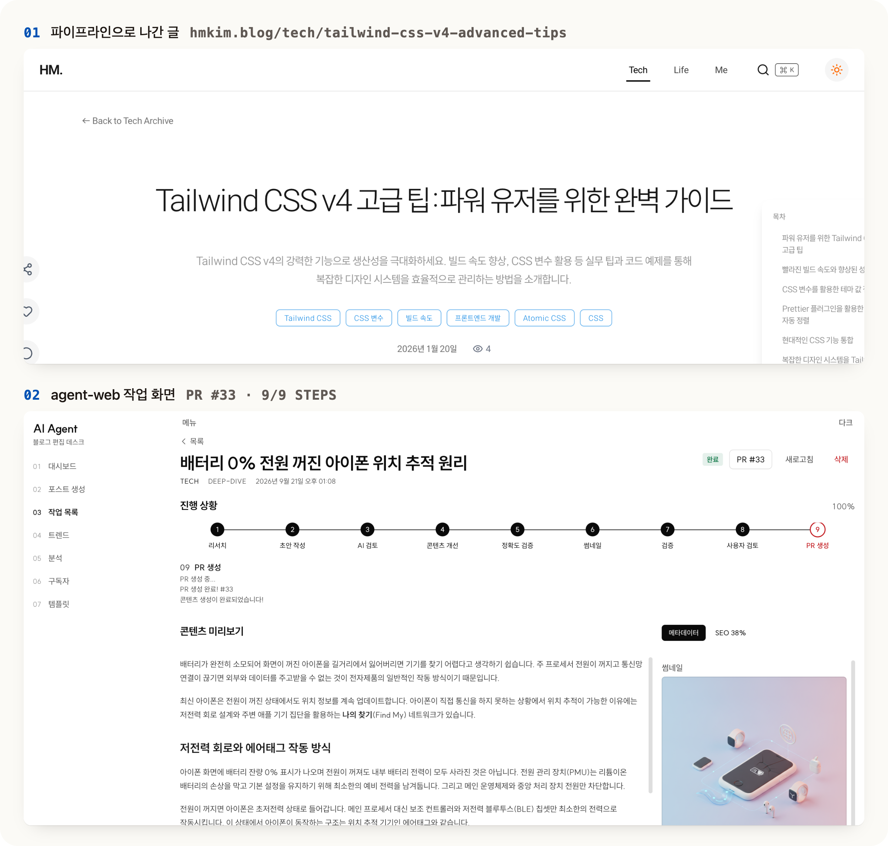
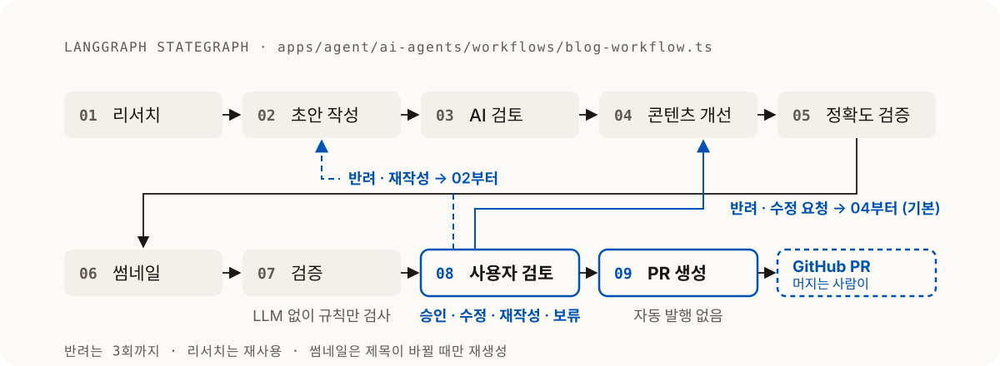

<p align="center">
  
</p>

[hmkim.blog](https://hmkim.blog)에 올라가는 글과, 그 글의 초안을 AI가 쓰고 사람이 검토해 PR로 내보내는 파이프라인을 한 저장소에서 운영한다. 글은 자동으로 발행되지 않는다. 검토와 머지는 사람이 한다.

<p align="center">
  
</p>

위는 파이프라인으로 나간 글 중 하나이고, 아래는 그 글을 만든 agent-web의 작업 화면이다. 지금까지 블로그 105편 중 12편이 이 경로로 나갔다 (2026-01-19 ~ 02-13, `post/` 브랜치 머지 기준).

## 왜 자동 발행하지 않는가

애매한 신호는 자동으로 처리하지 않고 사람에게 넘긴다. 이 블로그는 이력서에 링크하는 자산이라, 검토 없이 나간 글 한 편이 전체 신뢰도를 깎는다.

- **사람이 개입하는 지점이 두 곳이다.** 사용자 검토에서 내용을 판단하고, PR 생성 승인에서 발행을 결정한다. 머지는 GitHub에서 사람이 한다.
- **형식 검증은 LLM에 맡기지 않는다.** 제목 길이, 태그 수, 코드블록 짝 같은 규칙은 결정론적으로 검사한다. LLM 출력을 다시 LLM으로 검증하면 검증 자체가 비결정적이 된다.
- **반려 비용을 통제한다.** 반려하면 리서치는 다시 하지 않고, 사람이 검토한 최종본에 피드백만 반영해 다시 돈다. 반려는 3회까지다.

## 어떻게 동작하는가

<p align="center">
  
</p>

LangGraph `StateGraph`로 선언한 9노드 워크플로우다. 모든 LLM 노드는 Gemini 3.6 Flash 하나를 쓴다.

- **08 사용자 검토**에서 승인, 수정 요청, 재작성, 보류 중 하나를 고른다. 수정 요청은 04 콘텐츠 개선부터, 재작성은 02 초안 작성부터 다시 돈다.
- **07 검증**이 실패한 글은 승인해도 PR을 만들지 않는다. 형식이 깨진 파일로 블로그 빌드를 깨지 않기 위한 하한선이다.
- **09 PR 생성**은 `post/{날짜}-{slug}` 브랜치를 만들고 PR을 올리는 데서 멈춘다.
- 썸네일은 제목이 바뀔 때만 다시 만든다. 이미지 생성이 가장 비싼 호출이다.

판단 근거와 세부 흐름은 [docs/ARCHITECTURE.md](docs/ARCHITECTURE.md)에 있다. 그래프 분기는 [apps/agent/tests](apps/agent/tests)에서 에이전트를 stub해 검사한다.

## 시작하기

Node.js 22 이상과 pnpm 10.2.0이 필요하다.

```bash
pnpm install
cp .env.example .env.local
```

`.env.local`에 채울 값:

- 블로그 데이터: `NEXT_PUBLIC_SUPABASE_URL`, `NEXT_PUBLIC_SUPABASE_ANON_KEY`
- AI 모델: `GOOGLE_API_KEY` (Gemini)
- 리서치 웹 검색: `TAVILY_API_KEY`
- PR 생성: `GITHUB_TOKEN`, `GITHUB_OWNER`, `GITHUB_REPO`, `GITHUB_BASE_BRANCH`

```bash
pnpm dev                # 블로그(3000)와 agent-web(3001)을 함께 실행
pnpm dev:blog           # 블로그만
pnpm dev:agent-web      # agent-web만
pnpm generate-post      # 터미널에서 주제를 넣어 9단계 워크플로우 실행
```

`pnpm generate-post`는 터미널에서 검토와 승인을 받고, agent-web은 같은 워크플로우를 브라우저에서 돌리면서 진행 상황을 Supabase에 기록하고 스트리밍한다.

## 구조

```
apps/
├── blog/            # Next.js 16 + Keystatic 블로그 (port 3000)
│   └── content/     # tech, life 카테고리의 .mdoc 포스트
├── agent/           # LangGraph 워크플로우와 CLI
│   └── ai-agents/   # workflows/, agents/, tools/, config/
└── agent-web/       # 워크플로우 관리 UI (port 3001)
supabase/
└── migrations/      # 댓글, 조회수, 좋아요, 구독자, 작업 로그
```

| 영역 | 기술 |
|------|------|
| 블로그 | Next.js 16, React 19, Keystatic, Markdoc, Tailwind CSS v4 |
| 파이프라인 | LangChain, LangGraph `StateGraph`, Gemini 3.6 Flash, Octokit |
| agent-web | Next.js 16, React Query, React Hook Form, Zod, shadcn/ui |
| 데이터 | Supabase |
| 모노레포 | pnpm 10, Turborepo, GitHub Actions |

## 문서

- [docs/ARCHITECTURE.md](docs/ARCHITECTURE.md) - 파이프라인 설계와 판단 근거
- [docs/PRD.md](docs/PRD.md) - 블로그 제품 요구사항
- [apps/agent-web/PRODUCT.md](apps/agent-web/PRODUCT.md) - agent-web의 사용자, 목적, 미정 사항
- [apps/agent-web/DESIGN.md](apps/agent-web/DESIGN.md) - agent-web 디자인 체계

## 빌드와 테스트

```bash
pnpm build                   # 전체 빌드
pnpm lint                    # 전체 린트
pnpm --filter agent test     # 워크플로우 그래프 분기, 검증 규칙, 팩트체크 테스트
```

CI는 push와 PR마다 agent 타입체크·테스트와 agent-web 타입체크를 돌린다.

## 배운 점

- Keystatic을 활용한 Git 기반 CMS 구축 방법
- LangChain/LangGraph로 사람 개입 지점을 둔 워크플로우 설계
- Turborepo 모노레포에서 여러 Next.js 앱을 효율적으로 관리하는 방법
- Supabase를 활용한 서버리스 백엔드 구성
