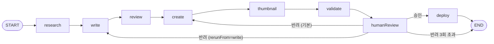

# AI 포스트 생성 파이프라인 아키텍처

`apps/agent`의 워크플로우가 어떻게 구성되어 있고, 왜 그렇게 판단했는지 기록한다.
코드: `apps/agent/ai-agents/workflows/blog-workflow.ts`

## 워크플로우

LangGraph `StateGraph`로 선언한 8개 노드. 모든 LLM 노드는 Gemini 2.0 Flash 하나를 쓴다.



| 노드 | 역할 | LLM |
|---|---|---|
| research | 웹 검색 + 요약 | ○ |
| write | 초안 작성 | ○ |
| review | SEO·기술 정확도 리뷰 | ○ |
| create | 리뷰와 사람 피드백을 반영해 최종본·메타데이터 생성 | ○ |
| thumbnail | 16:9 썸네일 이미지 생성 | ○ (이미지) |
| validate | 형식 규칙 검사 | × |
| humanReview | 사람이 승인 또는 반려 | × |
| deploy | 브랜치 생성 + PR | × |

## 사람이 개입하는 지점 두 곳

### 1. humanReview: 내용 품질은 사람이 판단한다

`validate`는 제목 60자, 요약 150자, 태그 3~5개, 본문 500자, 코드블록 백틱 짝만 본다.
LLM 출력의 형식 검증을 다시 LLM에 맡기면 검증 자체가 비결정적이 되기 때문이다.
내용이 맞는지, 블로그에 올릴 만한지는 `humanReview`에서 사람이 결정한다.
검증이 실패해도 워크플로우를 멈추지 않고 오류 목록을 사람에게 보여준다. 최종 판단은 어차피 사람이 한다.

### 2. deploy: 자동 발행하지 않는다

`deploy`는 블로그에 직접 커밋하지 않는다. `post/{날짜}-{slug}` 브랜치를 만들고 PR을 올린다.
머지 권한은 사람에게 있다.

이유는 세 가지다.

- 이 블로그는 이력서에 링크하는 자산이다. 검토 없이 나간 글 한 편이 전체 신뢰도를 깎는다.
- PR 화면이 두 번째 검토 창구가 된다. CLI에서 놓친 부분을 diff로 다시 본다.
- 되돌리기가 쉽다. 브랜치를 닫으면 끝이다.

두 게이트 모두 같은 판단에서 나왔다. **애매한 신호는 자동으로 처리하지 않고 사람에게 넘긴다.**

## 재실행 비용 통제

반려 한 번에 파이프라인 전체를 다시 돌리면 무료 티어 한도를 금방 소진한다.

- **리서치는 항상 재사용한다.** 주제가 바뀌지 않는 한 다시 검색할 이유가 없다.
- **기본 재진입점은 `create`다.** 사람 피드백을 프롬프트에 반영하는 노드가 `create`이므로, 초안과 리뷰를 다시 만들지 않아도 피드백이 적용된다. write·review 호출 2회를 아낀다.
- **전면 재작성은 명시적으로 요청한다.** `rerunFrom: 'write'`를 주면 초안부터 다시 쓴다. 이때 writer 프롬프트에도 피드백이 들어간다.
- **썸네일은 slug가 그대로면 재생성하지 않는다.** 이미지 생성이 가장 비싼 호출이고, slug는 제목에서 나오므로 제목이 바뀌지 않았다는 뜻이다.
- **반려 상한은 3회다.** 넘기면 배포 없이 종료한다. LangGraph `recursionLimit`도 이 값에서 계산한다.

## 실행 경로 두 가지

같은 그래프를 두 곳에서 호출한다. 콜백을 `config.configurable`로 넘기므로 그래프 코드는 공유한다.

| | CLI (`pnpm generate-post`) | agent-web |
|---|---|---|
| humanReview | 터미널 프롬프트 | Supabase `jobs` 행을 2초 간격 폴링, 30분 타임아웃 |
| deploy | 그래프 안에서 바로 PR | `skipDeploy: true`로 멈춘 뒤 `pending_deploy` 상태에서 별도 승인 후 PR |
| 반려 재진입점 | 수정 요청 → create, 다시 작성 → write | 항상 create (액션을 저장하지 않음) |

agent-web은 humanReview 시점에 상태를 DB에 저장하고 배포 시점에 다시 읽는다.
프로세스가 죽어도 `pending_deploy` 이후 단계는 이어갈 수 있다. humanReview 대기 중에 죽으면 처음부터 다시 돌려야 한다.
LangGraph checkpointer(Postgres)를 붙이면 해결되지만 agent-web에 재개 API가 필요해 아직 하지 않았다.

## 운영 수치

파이프라인으로 나간 포스트는 PR 제목 `[Content]`와 브랜치 `post/` 접두어로 구분된다.

```bash
git log --merges --format='%ad %s' --date=short --grep='\[Content\]'
```

반려 횟수와 소요 시간은 agent-web의 `progress_logs` 테이블에서 `step = 'human_review'` 행을 세면 나온다.

## 에러 처리

- Gemini 429는 LangChain `AsyncCaller`의 지수 백오프에 맡긴다 (`maxRetries: 3`).
- 썸네일 생성은 실패해도 `null`을 돌려주고 진행한다. 이미지는 나중에 Keystatic에서 넣을 수 있다.
- 그 외 노드 오류는 그대로 던진다. CLI는 종료하고 agent-web은 job을 `failed`로 기록한다.

## 테스트

`pnpm --filter agent test`

- `tests/blog-workflow.test.ts`: 에이전트를 stub하고 실제 그래프를 돌려 분기(재진입점, 썸네일 재사용, 반려 상한, deploy 조건)를 확인
- `tests/validator.test.ts`: 형식 규칙
