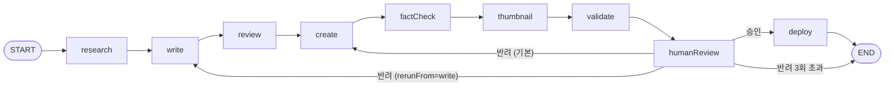

# AI 포스트 생성 파이프라인 아키텍처

`apps/agent`의 워크플로우가 어떻게 구성되어 있고, 왜 그렇게 판단했는지 기록한다.
코드: `apps/agent/ai-agents/workflows/blog-workflow.ts`

## 워크플로우

LangGraph `StateGraph`로 선언한 9개 노드. 모든 LLM 노드는 Gemini 3.6 Flash 하나를 쓴다.



| 노드 | 역할 | LLM |
|---|---|---|
| research | 웹 검색 + 요약 | ○ |
| write | 초안 작성 | ○ |
| review | SEO·기술 정확도 리뷰 | ○ |
| create | 리뷰 지적사항, 정확도 검증 지적(재실행 시), 사람 피드백을 반영해 최종본·메타데이터 생성 | ○ |
| factCheck | 최종본의 사실 주장을 리서치 자료와 대조. 참고용이라 배포를 막지 않음 | ○ |
| thumbnail | 16:9 썸네일 이미지 생성 | ○ (이미지) |
| validate | 형식 규칙 검사 | × |
| humanReview | 사람이 승인 또는 반려 | × |
| deploy | 브랜치 생성 + PR | × |

## 사람이 개입하는 지점 두 곳

### 1. humanReview: 내용 품질은 사람이 판단한다

`validate`는 제목 60자, 요약 150자, 태그 3~5개, 본문 500자, 코드블록 백틱 짝만 본다.
LLM 출력의 형식 검증을 다시 LLM에 맡기면 검증 자체가 비결정적이 되기 때문이다.
내용이 맞는지, 블로그에 올릴 만한지는 `humanReview`에서 사람이 결정한다.
검증이 실패해도 워크플로우를 멈추지 않고 오류 목록과 함께 사람에게 보여준다. 사람은 어떤 피드백으로 어디부터 다시 돌릴지 정한다.
단, 검증 실패 상태에서는 승인해도 PR을 만들지 않는다. 그래프에서는 humanReview의 조건부 엣지가 deploy 대신 END로 보내고, agent-web의 executeDeploy에도 같은 게이트가 있다. 형식이 깨진 파일로 블로그 빌드를 깨지 않기 위한 하한선이다.

### factCheck는 게이트가 아니다

`factCheck`는 최종본에서 동작 설명·기본값·수치·코드의 함수 호출을 전부 나열하고, 하나씩 리서치 자료의 문장과 대조한다.
확인하기 쉬운 문장만 고르면 틀린 문장을 놓치기 때문에 고르지 않고 전부 나열하게 했다.
결과는 humanReview 화면에 보여주기만 하고 배포를 막지 않는다. 고칠지는 사람이 정하고, 반려하면 지적 항목이 create 프롬프트에 함께 들어간다.

게이트로 쓰지 않는 이유는 한계가 분명해서다 (2026-09-21 실측).

- 자료에 명시된 사실과 어긋나는 문장은 잡는다. 기본값을 반대로 적은 문장을 `contradicted`로 잡았다.
- 자료에 근거가 없으면 모델 지식으로 판정하는데, 글을 쓴 모델과 검증하는 모델이 같아 같은 착각을 공유한다. 잘못된 `invalidateQueries` 인자 위치를 "맞다"고 판정했다.
- 검증 품질의 천장은 리서치 자료다. Tavily 결과에 주제와 무관한 글이 절반 섞였을 때는 같은 오류를 놓쳤고, 관련도(score) 0.2 미만을 버린 뒤에는 잡았다 (`dropIrrelevant`).

이 단계가 실패해도(429, JSON 파싱 실패) 워크플로우는 멈추지 않는다.

### 2. deploy: 자동 발행하지 않는다

`deploy`는 블로그에 직접 커밋하지 않는다. `post/{날짜}-{slug}` 브랜치를 만들고 PR을 올린다.
머지 권한은 사람에게 있다.

이유는 세 가지다.

- 이 블로그는 이력서에 링크하는 자산이다. 검토 없이 나간 글 한 편이 전체 신뢰도를 깎는다.
- PR 화면이 두 번째 검토 창구가 된다. CLI에서 놓친 부분을 diff로 다시 본다.
- 되돌리기가 쉽다. 브랜치를 닫으면 끝이다.

두 게이트 모두 같은 판단에서 나왔다. **애매한 신호는 자동으로 처리하지 않고 사람에게 넘긴다.**

## 글쓰기 규칙

`ai-agents/config/style-guide.ts`에 번역투와 AI가 쓴 티가 나는 표현을 금지하는 규칙을 두고 writer와 creator가 함께 쓴다.
규칙마다 X → O 예시를 붙였다. reviewer도 같은 기준으로 문장을 지적해 creator에 넘긴다.
"군더더기를 지워라"는 지시는 내용 축소로 번지기 쉽다. 실제로 본문이 6965자에서 3230자로 줄고 해결 방법 하나가 빠졌다.
그래서 규칙 끝에 분량을 줄이라는 뜻이 아님을 밝히고, creator에는 초안이 다루는 절·해결 방법·코드 예제를 빠뜨리지 말라고 적었다.

## 재실행 비용 통제

반려 한 번에 파이프라인 전체를 다시 돌리면 무료 티어 한도를 금방 소진한다.

- **리서치는 항상 재사용한다.** 주제가 바뀌지 않는 한 다시 검색할 이유가 없다.
- **기본 재진입점은 `create`다.** 사람이 검토한 최종본을 초안 자리에 놓고 피드백만 반영한다. 초안과 리뷰를 다시 만들지 않아 write·review 호출 2회를 아끼고, 이전 라운드의 수정이 유지된다.
- **전면 재작성은 명시적으로 요청한다.** `rerunFrom: 'write'`를 주면 초안부터 다시 쓴다. 이때 writer 프롬프트에도 피드백이 들어간다.
- **썸네일은 제목이 그대로면 재생성하지 않는다.** 이미지 생성이 가장 비싼 호출이다. slug는 첫 실행 값을 유지해 URL과 이미지 경로가 흔들리지 않게 한다.
- **반려 상한은 3회다.** 넘기면 배포 없이 종료한다. LangGraph `recursionLimit`도 이 값에서 계산한다.

## 실행 경로 두 가지

같은 그래프를 두 곳에서 호출한다. 콜백을 `config.configurable`로 넘기므로 그래프 코드는 공유한다.

| | CLI (`pnpm generate-post`) | agent-web |
|---|---|---|
| humanReview | 터미널 프롬프트 | Supabase `jobs` 행을 2초 간격 폴링, 30분 타임아웃 |
| deploy | 그래프 안에서 바로 PR | `skipDeploy: true`로 멈춘 뒤 `pending_deploy` 상태에서 별도 승인 후 PR |
| 반려 재진입점 | 수정 요청 → create, 다시 작성 → write | 수정 요청 → create, 재작성 → write (`progress_logs`의 액션으로 판별) |

agent-web은 humanReview 시점에 상태를 DB에 저장하고 배포 시점에 다시 읽는다.
프로세스가 죽어도 `pending_deploy` 이후 단계는 이어갈 수 있다.
humanReview 대기 중에 죽은 작업도 이어갈 수 있다. 승인은 route가 직접 `pending_deploy`로 바꾼다.
수정 요청·재작성은 route가 `resumeAfterReview`를 불러 DB 상태로 그래프를 다시 시작한다 (초기 상태의 `rerunFrom`으로 create/write에 바로 진입).
폴링 루프가 살아 있는지는 프로세스 안의 job 집합으로 판단하므로 단일 프로세스가 전제다.
`tone`·`targetReader`는 `init` 로그에서, 누적 반려 횟수는 마지막 human_review 대기 로그의 `data.rejections`에서 복원한다 (상한 `MAX_REJECTIONS`도 그대로 적용).
그 밖의 단계(research~validate)에서 죽으면 처음부터 다시 돌려야 한다. LangGraph checkpointer(Postgres)를 붙이면 해결되지만 아직 하지 않았다.

## 운영 수치

파이프라인으로 나간 포스트는 브랜치 `post/{날짜}-{slug}`로 구분된다. (PR 제목 `[Content]` 접두어는 2026-01-22부터 붙어 그 이전 분을 놓친다.)

```bash
git log --merges --format='%ad %s' --date=short | grep 'post/'
```

2026-09-02 기준 12편 (2026-01-19 ~ 02-13).

반려 횟수와 소요 시간은 agent-web의 `progress_logs` 테이블에서 `step = 'human_review'` 행을 세면 나온다.

## 에러 처리

- Gemini 429는 LangChain `AsyncCaller`의 지수 백오프에 맡긴다 (`maxRetries: 3`).
- 썸네일 생성은 실패해도 `null`을 돌려주고 진행한다. 이미지는 나중에 Keystatic에서 넣을 수 있다.
- 그 외 노드 오류는 그대로 던진다. CLI는 종료하고 agent-web은 job을 `failed`로 기록한다.

## 테스트

`pnpm --filter agent test`

- `tests/blog-workflow.test.ts`: 에이전트를 stub하고 실제 그래프를 돌려 분기(재진입점, 썸네일 재사용, 반려 상한, deploy 조건)를 확인
- `tests/validator.test.ts`: 형식 규칙
- `tests/gemini-creator.test.ts`: 모델 응답에서 본문만 남기는지 (머리말·수정 리포트 제거)
- `tests/fact-checker.test.ts`: 검증 결과 정규화, 실패해도 던지지 않는지
- `tests/gemini-researcher.test.ts`: 검색 결과 관련도 필터
- `tests/git-manager.test.ts`: 브랜치가 이미 있을 때 새 브랜치로 커밋·PR이 나가는지, 파일이 이미 있을 때 sha를 붙이는지
